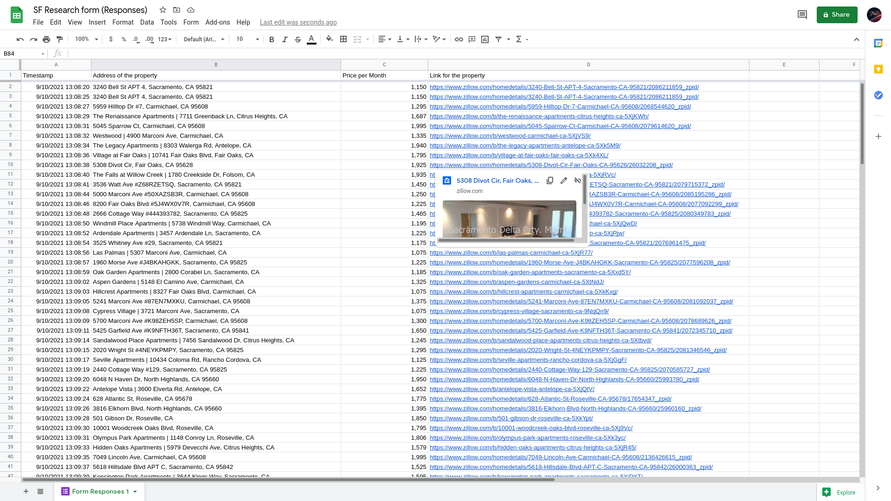

Day 53
===============================================================================

Things I Learned
-------------------------------------------------------------------------------

- [x] Flask
- [x] ```__name__``` and ```__main__```
- [x] Decorator functions

I also made project to get all the zillow listings using BeautifulSoup on a
specific page and insert that data using Selenium and google forms.




Good [article](https://www.geeksforgeeks.org/__name__-special-variable-python/) for learning about __name__ and __main__ in python.
