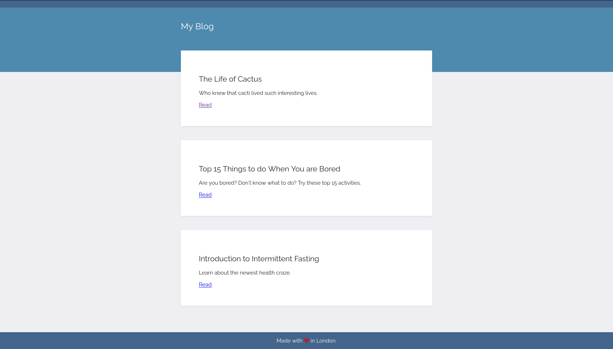
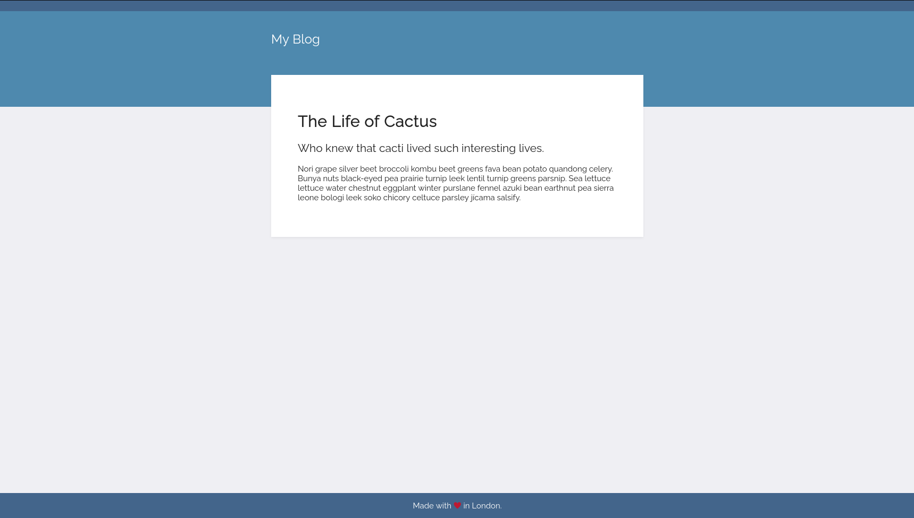

Day 55
===============================================================================

Things I Learned
-------------------------------------------------------------------------------

- [x] Templating with Jinja
- [x] Dynamic URLs with Jinja
- [x] Routing in Jinja

I also built a simple blog site with dummy data to get the hang of Jinja and how things work. Find the code for the same in Project folder.

