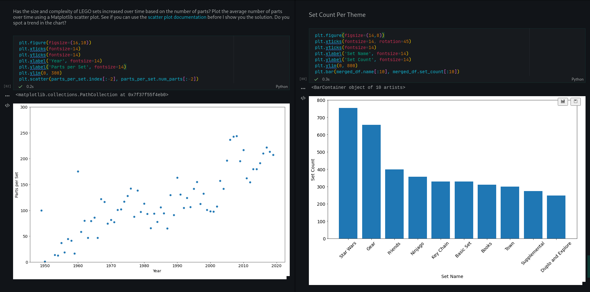

Day 73
================================================================================

Things I Learned
--------------------------------------------------------------------------------

- [x] Aggregate and merge functions
- [x] Working with relational Databases and Schemas
- [x] Scatter Plots and Bar Charts

Today I worked with lego datasets from [Rebrickable](https://rebrickable.com/downloads/) to try and find patterns and trends using pandas and matplotlib using some of the functions like ```agg(), nunique(), count()```



