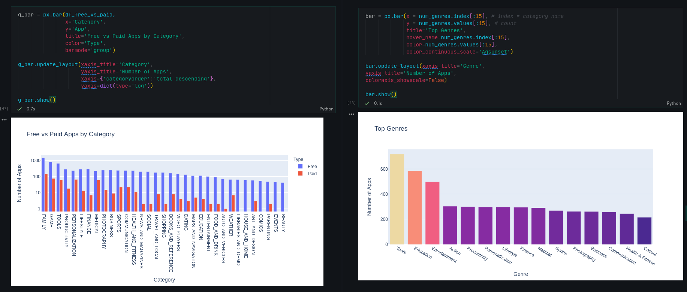

Day 75
================================================================================

Things I Learned
--------------------------------------------------------------------------------

- [x] Plotly Bar, Pie, Box Charts and Graphs
- [x] Extracting nested column data using .stack()
- [x] Numeric type conversion
  
Today I worked with Google Play Store data. App and review data was scraped from the Google Play Store by Lavanya Gupta in 2018. Original files listed [here](
https://www.kaggle.com/lava18/google-play-store-apps).

