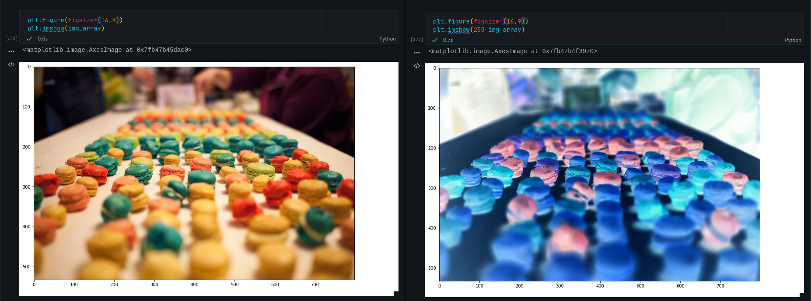

Day 76
================================================================================

Things I Learned
--------------------------------------------------------------------------------

- [x] Intro to Numpy Module
- [x] Creating arrays with np.array()
- [x] Generate arrays with .arange(), .random(), .linspace()
- [x] Analysis of arrays with ndim(), shape()
- [x] Image Manipulation with Numpy and Scipy
- [x] Scalars and Broadcasting

