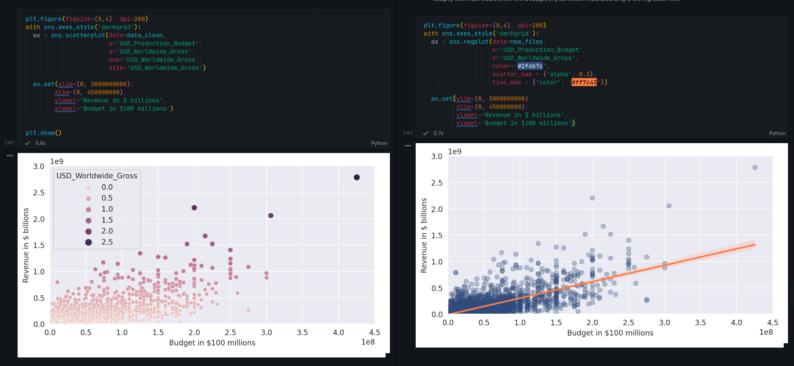

Day 77
================================================================================

Things I Learned
--------------------------------------------------------------------------------

- [x] Seaborn Bubble Charts
- [x] query() function in pandas to filter data
- [x] Run regressions with scikit-learn
- [x] Use Seaborn to superimpose a linear regressions

