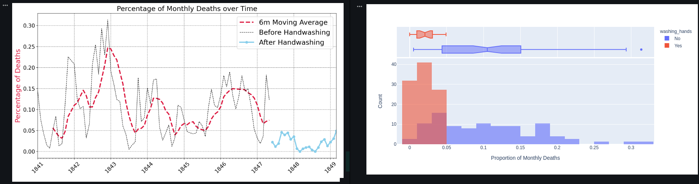

Day 79
================================================================================

Things I Learned
--------------------------------------------------------------------------------

- [x] use histograms to visualise distributions
- [x] superimpose histograms
- [x] Kernel Density Estimate (KDE)

