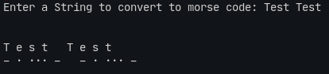

# Day 81

## Goal/Challenge

To Create a Text to Morse Code Converter Program that is run in the command line.

### My Approach to Project

I thought of creating a dictionary as a reference containing all the morse code equivalent of the letters and numbers, then I created two functions:

1. ```letter_to_morse```: This function takes a letter(string) as an argument and returns equivalent morse code. If KeyError occurs then returns the passed argument.

2. ```string_to_morse```: This function takes a string and passes all the letters in that string one by one(for loop) to the letter_to_morse function and then prints the final result.

Nothing felt too hard, thanks to all the practice for the last 80 days, and since this was a project based on the first 10 days of the course.


